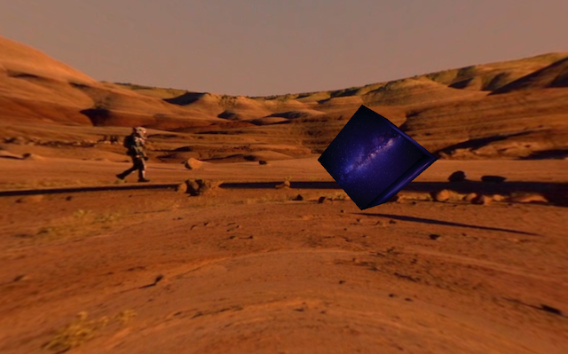

#   Virtual Reality Spaceship
###### A project by the Makers Academy Space Administration
***

### Crew
We're a team of four aiming to build a Virtual Reality experience to view different locations in space via interactions with voice recognition technology.

- [Naz Malik](https://github.com/nazwhale)
- [Kate Gleeson](https://github.com/allbecauseyoutoldmeso)
- [Jean-Jacques Calbayrac](https://github.com/gekographe)
- [Ruan Odendaal](https://github.com/ruanodendaal)

### Log Book
#### Day 1
After arriving at Makers Academy HQ, the four of us gathered for a design sprint. We planned to interact with virtual reality using voice commands to Amazon's Alexa in order to transport the user to different planets. However, we first needed to clarify an MVP.

After a morning of constructive conversations reviewing our existing assumptions about VR and voice interaction, exploring as many possibilities as possible for our idea, then honing in on an MVP, we arrived at our mission statement: To switch VR views using voice commands to Alexa. Importantly, it must be sufficiently tested. Once this is satisfied, we can begin to fill those VR views will galactic environments from NASA's space rovers.

Next, we tried out [Google Cardboard](https://vr.google.com/cardboard/) and, after some thorough research including tutorials with [Google's standard developer kits for VR](https://developers.google.com/vr/cardboard/overview) and JJ managing to render a 360 degree photo in Google Cardboard, decided that an in-browser VR built in Unity with C# would be best suited to our mission. Certainly more technologies will be needed, but for now we have a place to start.

As none of us had any significant experience with Unity or C#, we set about educating ourselves by completing [Unity's roll-a-ball tutorial](https://unity3d.com/learn/tutorials/projects/roll-ball-tutorial). After, we plan to hack around in our Unity projects, adapting them for VR, then working on finding a way to switch between multiple VR views. Only once that is completed will we try and implement this functionality with Alexa.

Overall a very positive and productive day. We have a hell of a lot to do in 2 weeks, but spirits are high.

The earth looks mighty fine from up here.

*Major Naz*

#### Day 2
Building on our day 1 success we were all energized to dive a little deeper into VR. However after a good start we kept hitting blockers and our lack of experience in VR was becoming apparent. Post lunch we changed course and started to experiment with using [A-Frame](https://aframe.io) to build our VR model. Being built by the originators of WebVR and providing a clear structure to `three.js`, we were started to see immediate results.

By the end of the day we'd built a VR environment compatible with Google Cardboard that we can traverse!

 

A great end to a tough day, searching for our purpose...but we're one step closer.

*Shipmate Odendaal*

### Technology
TBC
